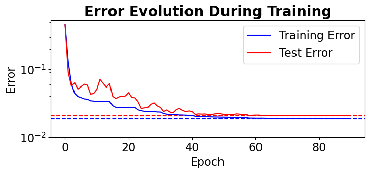
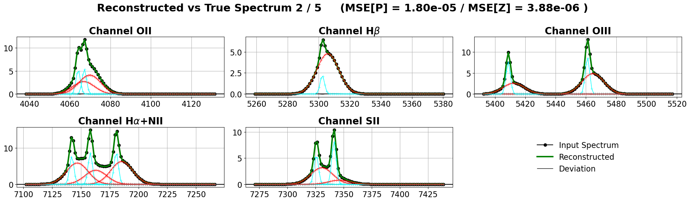
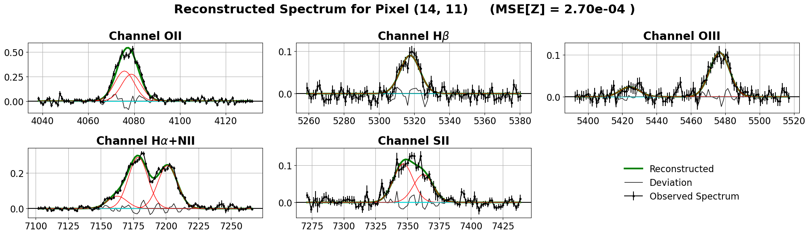

# Spectral Line Reconstruction in a Galaxy Merger with Constrained Gaussian Profiles and PyTorch

This project explores how to reconstruct **multi-line spectroscopic emission features** from a galaxy-merger system by representing each line as a sum of Gaussian components and training a **neural network** via `PyTorch` to infer the underlying parameters directly from spectra.

---

## Table of Contents

* [Scientific Motivation](#scientific-motivation)
* [What The Code Does](#what-the-code-does)
* [Method Overview](#method-overview)

  * [1. Spectral windows and emission lines](#1-spectral-windows-and-emission-lines)
  * [2. Constrained Gaussian parameterization](#2-constrained-gaussian-parameterization)
  * [3. Synthetic training data generation](#3-synthetic-training-data-generation)
  * [4. Neural network architecture](#4-neural-network-architecture)
  * [5. Losses and optimization](#5-losses-and-optimization)
  * [6. Prediction refinement](#6-prediction-refinement)
* [Dependencies](#dependencies)

---

## Scientific Motivation

Galaxy mergers often produce complex emission-line profiles that cannot be described well by a single Gaussian component. Multiple kinematic components may coexist along the line of sight, for example because of overlapping gas systems, disturbed dynamics, or outflow/inflow structures. This project tackles that problem by modeling each emission line with **two Gaussian components** and learning to recover the associated amplitudes and shared kinematic parameters from the observed spectra.

---

## What The Code Does

Two jupyter notebooks can be explored:

* `gaussian_fit_toy.ipynb`: a **toy setup** built on artificial data and simplified synthetic channels,

* `gaussian_fit.ipynb`: a **real setup** that works with true physical emission lines and real-world spectra. Requires a MaNGA FITS cube, which can be found in the `data/` folder.

This code generally performs the following steps:

* Create the Gaussian model definition
    * The set of spectral windows;
    * Which lines fall into each window;
    * How many Gaussian components to use per line;
    * The free parameter limits;
    * The constraints tying parameters together.
* Generate synthetic training data with known ground-truth parameters
* Train a chosen neural network architecture
* Predict parameters from real-world or toy data
    * predict parameters with network
    * refinement step through classical optimization


---

## Method Overview

### 1. Spectral windows and emission lines

We organize the spectrum into **spectral windows** (or channels). In the real-data notebook, each window corresponds to frequency intervals of familiar groups of emission lines:

* OII,
* Hβ,
* OIII,
* Hα + NII,
* SII.

Each window contains one or more emission lines, and each line is modeled as a sum of two Gaussian components:

$$
I(x) = \sum_{k=1}^{2} A_k \exp\left(-\frac{(x-\mu_k)^2}{2\sigma_k^2}\right)
$$

In the simplified notebook, the same idea is demonstrated in a normalized setting with four toy channels (`I`, `II`, `III`, `IV`), each containing one synthetic line. This is useful as a proof-of-concept before moving to real wavelengths.

---

### 2. Constrained Gaussian parameterization

The inverse problem should not be treated as a completely free per-line fit. Instead, we enforce a structured parameterization in which all lines associated with the same physical component share common velocity and dispersion information. This reduces degeneracy and injects physically meaningful constraints into the learning problem.

The parameters $\mu$ and $\sigma$ of each emission line are not independent. Instead, we infer a smaller set of free parameters:

* amplitudes for each line and component;
* a shared velocity for each component;
* a shared velocity dispersion for each component.

Then, line-dependent centers and widths are reconstructed through constraints from the velocity and dispersion.

This logic is handled by the `ParameterMapping` class, which separates parameters into free and tied sets, then applies constraints. 

---

### 3. Synthetic training data generation

The inverse model is trained on artificially generated spectra whose true parameters are known.

The synthetic-data pipeline follows these steps:

1. Sample free parameters uniformly within predefined limits,
2. Sort the two components from lower to higher-velocity Gaussian,
3. Generate the combined signal with noise

Step 2 is important. The network is trained to return a consistent ordering of the two Gaussian components.

---

### 4. Neural network architecture

The learning task is an inverse regression problem with the goal of estimating all free Gaussian parameters.

Several candidate architectures are implemented and can be swapped in and out. We explore design families with Residual Blocks (ResNet), Coordinate Convolutions, different pooling and global aggregation methods. Please see `models.py` for a list of all architectures.

We finally settle for `CoordGaussNet_2` with 3M parameters. 
Coordinate Convolution models inject explicit coordinate information into the convolutional pipeline, which is attractive for spectroscopy because the exact position of peaks matters.

```mermaid
flowchart TD
    A["Input<br/>4 × 100"]

    B["CoordConv1D, 4 → 32<br/>k = 5"]
    C["CoordConv1D, 32 → 64<br/>k = 3"]
    P1["MaxPool1D<br/>÷2"]

    D["CoordConv1D, 64 → 128<br/>k = 3"]
    E["CoordConv1D, 128 → 128<br/>k = 3"]
    P2["MaxPool1D<br/>÷2"]

    F["CoordConv1D, 128 → 256<br/>k = 3"]
    G["CoordConv1D, 256 → 256<br/>k = 3"]
    P3["MaxPool1D<br/>÷2"]

    H["CoordConv1D, 256 → 512<br/>k = 3"]
    I["CoordConv1D, 512 → 512<br/>k = 3"]
    P4["MaxPool1D<br/>÷2"]

    J["Flatten"]
    K["Linear<br/>3840 → 768"]
    L["Dropout + Sigmoid"]
    M["Linear<br/>768 → 24"]
    N["Output<br/>24"]

    A --> B --> C --> P1
    P1 --> D --> E --> P2
    P2 --> F --> G --> P3
    P3 --> H --> I --> P4
    P4 --> J --> K --> L --> M --> N

    classDef input fill:#f5f5f5,stroke:#666,stroke-width:1px,color:#111;
    classDef coordconv fill:#e3f2fd,stroke:#1e88e5,stroke-width:1px,color:#111;
    classDef pool fill:#e8f5e9,stroke:#43a047,stroke-width:1px,color:#111;
    classDef reshape fill:#fff3e0,stroke:#fb8c00,stroke-width:1px,color:#111;
    classDef linear fill:#f3e5f5,stroke:#8e24aa,stroke-width:1px,color:#111;
    classDef regularize fill:#fce4ec,stroke:#d81b60,stroke-width:1px,color:#111;
    classDef output fill:#ede7f6,stroke:#5e35b1,stroke-width:1px,color:#111;

    class A input;
    class B,C,D,E,F,G,H,I coordconv;
    class P1,P2,P3,P4 pool;
    class J reshape;
    class K,M linear;
    class L regularize;
    class N output;
```



---

### 5. Losses and optimization

We explore two complementary losses: the **parameter loss** (mean-squared error on free parameters), and the **signal loss** (mean-squared error on the reconstructed spectra).
In training we combine both into a weighted criterion, so the network is encouraged both to recover the correct parameters and to reconstruct the observed signal accurately.

Training uses the `Adam` optimizer with early stopping. In the real data, we achieve a minimum training loss of about `1.865e-02` and a minimum test loss of about `2.055e-02` (see Figure A).

<p align="center">
  
  <br>
  <em>Figure A. Training and test error evolution during optimization, showing convergence and early stopping.</em>
</p>

Example reconstructed spectra can be seen in Figure B.

<p align="center">
  
  <br>
  <em>Figure B. Reconstruction quality on held-out synthetic data, showing predicted spectra, component profiles, and residuals.</em>
</p>

---

### 6. Prediction refinement

After the network predicts the free parameters, we perform a second stage of refinement using traditional parameter fitting.

We treat the network output as an initial guess for a short gradient-based optimization directly against the signal. We find that this step further improves the quality of the prediction.

<p align="center">
  
  <br>
  <em>Figure C. Examples of model reconstructions on real galaxy-merger spectra across multiple emission-line windows.</em>
</p>

---

## Dependencies

Requirements for running this project:

```bash
pip install torch numpy matplotlib astropy pyyaml
```

For opening the notebook environment, you may also want:

```bash
pip install ipython jupyter
```

---
